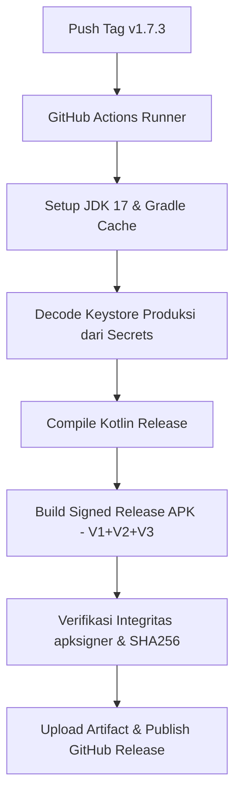

# 📱 PETUGAS P2KD (Aplikasi Android Native Coklit Lapangan)

[](https://github.com/pkd-develzy/build.apk_p2kd/actions/workflows/release-android.yml)
[](https://github.com/pkd-develzy/build.apk_p2kd/releases/latest)
[](https://kotlinlang.org/)
[-blue?logo=jetpackcompose)](https://developer.android.com/jetpack/compose)
[-green?logo=android)](https://developer.android.com)

**PETUGAS P2KD** adalah aplikasi mobile Android **Native** resmi yang dirancang dan dibangun khusus untuk menunjang tugas operasional **Petugas Pemutakhiran Data Pemilih (Pantarlih / Petugas Lapangan)** dalam Pemilihan Kepala Desa (Pilkades) Kalisalak.

Aplikasi ini menggantikan proses pencocokan dan penelitian (Coklit) manual berbasis kertas menjadi sistem digital terpadu yang cepat, akurat, dan memiliki validasi ketat, terhubung langsung dengan server pusat P2KD Desa Kalisalak.

---

## 🏛️ Filosofi Arsitektur & Prinsip Inti

```
┌─────────────────────────────────────────────────────────────┐
│                      1 RUMAH FISIK                          │
│          (Ditempeli 1 Stiker QR Code Permanen)              │
├──────────────────────────────┬──────────────────────────────┤
│       Keluarga A (KK 1)      │      Keluarga B (KK 2)       │
├──────────────────────────────┼──────────────────────────────┤
│ • Kepala Keluarga            │ • Kepala Keluarga            │
│ • Anggota Keluarga 1         │ • Anggota Keluarga 1         │
│ • Anggota Keluarga 2         │                              │
└──────────────────────────────┴──────────────────────────────┘
```

1. **1 QR Token = 1 Rumah Fisik = Banyak KK = Banyak Anggota Keluarga**:
   * Stiker fisik yang ditempel di depan rumah memuat kode unik berformat `KLK-HM-{RW}-{TOKEN}` (contoh: `KLK-HM-01-A1B2C3`).
   * Setiap stiker fisik berfungsi sebagai penanda koordinat/lokasi rumah. Petugas dapat menautkan lebih dari satu Kepala Keluarga (KK) ke dalam satu rumah fisik yang sama.
2. **Kemandirian Lapangan (Offline-First Ready)**:
   * Petugas dapat mengunduh cache data pemilih satu desa/RW ke penyimpanan lokal terenkripsi di HP.
   * Proses pencarian data dan verifikasi warga tetap berjalan mulus meskipun petugas berada di area minim sinyal (*blank spot*).
3. **Keamanan Sesi Tunggal (Single-Device Enforcement)**:
   * Kebijakan ketat: **1 Akun Petugas = 1 Smartphone Aktif**.
   * Jika akun yang sama dibuka di smartphone lain, sesi pada HP lama otomatis keluar (*session revoked*) seketika demi mencegah duplikasi dan manipulasi data.

---

## 🛠️ Ringkasan Framework & Stack Teknologi

| Komponen / Lapisan | Teknologi & Pustaka | Peran & Alasan Pemilihan |
| :--- | :--- | :--- |
| **Bahasa Pemrograman** | **Kotlin 1.9.22** | Bahasa resmi Android modern; bebas dari *NullPointerException*, coroutines-first, sintaks ringkas dan ekspresif. |
| **Framework UI** | **Jetpack Compose BOM (Material 3)** | Arsitektur UI Deklaratif murni (*no XML*). Render grafis sangat cepat, tema dark/emerald mewah, micro-animation responsif. |
| **Pola Arsitektur** | **MVVM / UDF (Unidirectional Data Flow)** | Pemisahan tegas antara State, Event, dan UI rendering menggunakan Kotlin StateFlow & Coroutine Scope. |
| **Navigasi Layar** | **Navigation Compose** | Manajemen rute layar berbasis *NavHost* dan *NavController* yang terstruktur. |
| **Kamera & QR Vision** | **AndroidX CameraX + Google ML Kit** | Pemrosesan citra kamera native resolusi tinggi dengan deteksi *Barcode/QR Code* sub-milidetik secara offline di perangkat. |
| **Konektivitas Jaringan** | **Retrofit 2.11.0 + OkHttp 4.12.0** | HTTP client berefisiensi tinggi dengan *Custom Auth Interceptor*, injeksi header `X-App-Version`, logging, dan timeout 30 detik. |
| **Keamanan & Kriptografi** | **AndroidX Security Crypto** | Enkripsi data sesi dan token otentikasi menggunakan **EncryptedSharedPreferences** berbasis Android Keystore (AES-256 GCM). |
| **Notifikasi Cloud** | **Firebase Cloud Messaging (FCM)** | Menerima instruksi siaran dinamis, pemberitahuan mutasi pemilih, dan *push alerts* langsung dari panitia desa. |
| **Pembaruan Live** | **AppUpdateManager (GitHub API)** | Pengecekan versi live otomatis langsung ke GitHub Releases, unduh APK di latar belakang, dan pemicu instalasi otomatis. |
| **Sistem Build & CI/CD** | **Gradle Kotlin DSL + GitHub Actions** | Kompilasi berbasis cloud otomatis, penandatanganan rilis (*V1+V2+V3 Scheme Signing*), dan auto-publishing ke GitHub Releases. |

---

## 📂 Struktur Direktori Proyek

```
app/src/main/java/id/p2kd/kalisalak/coklit/
├── P2kdApp.kt                        # Titik masuk aplikasi (Application class) & inisialisasi Firebase/Session
├── MainActivity.kt                   # Activity tunggal penampung NavHost Compose & sistem update
├── data/
│   ├── api/
│   │   ├── ApiClient.kt              # Konfigurasi OkHttp, Interceptor X-App-Version, dan Retrofit instance
│   │   └── ApiService.kt             # Kontrak endpoint REST API server backend P2KD
│   ├── firebase/
│   │   ├── FirebaseAuthHelper.kt     # Pengelola otentikasi Firebase
│   │   ├── FirestoreRepository.kt    # Repositori sinkronisasi Firestore cadangan
│   │   └── P2kdFirebaseMessagingService.kt # Penangan Push Notification & pendaftaran token perangkat
│   ├── local/
│   │   ├── LocalVoterCacheManager.kt # Manajemen cache ribuan data pemilih offline
│   │   └── OfflineQueueManager.kt    # Manajemen antrean mutasi & rekonsiliasi data Coklit
│   ├── models/
│   │   └── Models.kt                 # Data transfer objects (DTO), request, dan response API
│   ├── security/
│   │   └── EncryptedSessionManager.kt# Penyimpanan kredensial aman di Android Keystore
│   └── update/
│       └── AppUpdateManager.kt       # Pengelola pengecekan rilis GitHub & installer otomatis
├── ui/
│   ├── navigation/
│   │   ├── AppNavigation.kt          # Hub rute navigasi, bottom bar, dan validasi dialog scan
│   │   └── Screen.kt                 # Deklarasi rute sealed class
│   ├── screens/
│   │   ├── LoginScreen.kt            # Layar otentikasi petugas dengan visual elegan & dinamis
│   │   ├── HomeScreen.kt             # Dashboard utama ringkasan progres Coklit & aksi cepat
│   │   ├── CameraScanScreen.kt       # Pemindai kamera native ML Kit dengan Smart Regex Extractor
│   │   ├── HouseFormScreen.kt        # Formulir pendaftaran rumah & verifikasi koordinat
│   │   ├── KKListScreen.kt           # Manajemen kartu keluarga dalam satu rumah
│   │   ├── FamilyMemberListScreen.kt # Pengelolaan anggota keluarga dalam satu KK
│   │   ├── VoterDataScreen.kt        # Katalog pencarian DPT cepat & formulir mutasi pemilih
│   │   ├── ActivityHubScreen.kt      # Log riwayat operasional & aktivitas lapangan
│   │   ├── NotificationCenterScreen.kt # Pusat notifikasi sistem dengan fitur hapus per-item/semua
│   │   ├── MoreScreen.kt             # Pengaturan, cache sync, foto profil, dan info aplikasi
│   │   ├── RegisteredHousesScreen.kt # Daftar rumah yang telah terdata di lapangan
│   │   ├── TaskListScreen.kt         # Daftar penugasan Coklit per RT/RW
│   │   ├── VisitConfirmationScreen.kt# Konfirmasi kunjungan & rekapitulasi data Coklit
│   │   └── SyncHistoryScreen.kt      # Status antrean sinkronisasi offline-to-online
│   └── theme/
│       ├── Color.kt                  # Palet warna modern (Slate, Emerald, Navy, Amber, Red)
│       ├── Theme.kt                  # Material 3 Theme setup dengan Dark Mode elegan
│       └── Type.kt                   # Konfigurasi tipografi Roboto/Sans-Serif
```

---

## ⚙️ Fitur-Fitur & Sistem Utama

### 1. 🔍 Pemindai Stiker Cerdas (Smart QR Scanner)
* Kamera native CameraX membaca QR code secara real-time.
* Dilengkapi **Smart Token Regex Matcher** (`KLK-HM-\d{2}-[A-Za-z0-9]+`):
  * Mampu membaca stiker fisik yang berisi URL lengkap (`https://.../stiker-coklit?qr=KLK-HM-01-A1B2C3`), parameter query (`?token=...`), maupun string token murni.
* Jika token belum terdaftar di sistem atau terjadi kegagalan jaringan, aplikasi menampilkan dialog konfirmasi interaktif dengan tombol **Pindai Ulang** atau **Input Manual Token**.

### 2. 👥 Pencarian Data Pemilih Super Cepat & Caching
* Layar **Data Pemilih** mengindeks ribuan data pemilih DPT Desa Kalisalak.
* Dilengkapi filter cerdas: Nama, NIK (sensor bintang keamanan), No KK, RT, RW, dan TPS.
* Menyediakan fitur **Sinkronisasi Cache Offline**: Petugas dapat mengunduh ribuan data ke memori HP. Sebelum pengunduhan berjalan, aplikasi menyajikan dialog konfirmasi penggunaan kuota data internet seluler.

### 3. ✍️ Mutasi & Status Pemilih di Lapangan
Petugas dapat mengubah status pemilih secara instan dengan bukti catatan:
* **Cocok (Sesuai DPT)**: Pemilih valid dan terkonfirmasi.
* **Ubah Data**: Koreksi elemen data (Nama, Tempat/Tanggal Lahir, Status Kawin, Disabilitas, Alamat).
* **TMS (Tidak Memenuhi Syarat)**: Meninggal dunia, ganda, pindah domisili, di bawah umur, atau hilang hak pilih.
* **Pemilih Baru**: Penambahan warga yang telah memenuhi syarat namun belum tercantum di DPT.

### 4. 📊 Integrasi Model A.A & Rekapitulasi Otomatis
* Format resmi formulir **Model A.A** (Daftar Pemilih Hasil Pemutakhiran).
* Pada dashboard admin web, **Mode Rekapitulasi** terhubung secara reaktif dengan hasil pendaftaran rumah dan pemilih yang disubmit oleh petugas dari aplikasi Android.

### 5. 🛡️ Keamanan & Integritas Sesi
* Token JWT disimpan dalam **EncryptedSharedPreferences** yang diproteksi master key hardware Keystore.
* Setiap panggilan API menyertakan header otentikasi serta header versi `X-App-Version: 1.7.3`.
* Terintegrasi dengan bot Telegram panitia untuk pelaporan aktivitas real-time dengan rincian nama petugas, TPS, jenis aksi, dan nomor versi APK.

### 6. 🚀 Pembaruan Otomatis (Live In-App Updater)
* Pengguna tidak perlu menghapus aplikasi lama atau meminta file APK secara manual.
* Melalui tombol **Periksa Pembaruan** di menu Pengaturan (atau pengecekan berkala otomatis), aplikasi menghubungi GitHub API.
* Jika tersedia versi baru, aplikasi menampilkan catatan rilis (*changelog*), mengunduh file `PETUGAS_P2KD.apk` ke folder unduhan publik, dan langsung memicu *Package Installer Intent* Android.

---

## 🔒 Konfigurasi Keamanan & Hak Akses (Permissions)

Aplikasi meminta hak akses minimal yang benar-benar dibutuhkan untuk tugas operasional:
```xml
<!-- Akses Kamera untuk pemindaian QR stiker rumah -->
<uses-permission android:name="android.permission.CAMERA" />

<!-- Akses Internet untuk sinkronisasi ke server pusat -->
<uses-permission android:name="android.permission.INTERNET" />
<uses-permission android:name="android.permission.ACCESS_NETWORK_STATE" />

<!-- Notifikasi push (Android 13+) -->
<uses-permission android:name="android.permission.POST_NOTIFICATIONS" />

<!-- Getaran haptik saat QR berhasil terpindai -->
<uses-permission android:name="android.permission.VIBRATE" />

<!-- Pemasangan update APK langsung -->
<uses-permission android:name="android.permission.REQUEST_INSTALL_PACKAGES" />
```

---

## 🏗️ Alur Build & Rilis Produksi (CI/CD Pipeline)

Proses build aplikasi berjalan 100% otomatis melalui GitHub Actions (`release-android.yml`) setiap kali commit di-push ke branch `main` atau tag versi baru di-push:



### Konvensi Penomoran Versi P2KD:
* **Format**: `v1.X.Y` (Contoh saat ini: `v1.7.3`, `versionCode = 10`)
* **Aturan Kenaikan**:
  * Bilangan tengah bertambah setiap rilis fitur utama.
  * Bilangan akhir **wajib angka ganjil** (`1, 3, 5, 7, 9`).

---

## 📥 Tautan Unduh APK Rilis Resmi

APK produksi bertandatangan digital dapat diunduh langsung dari:
* **Halaman Rilis GitHub**: [GitHub Release PETUGAS P2KD](https://github.com/pkd-develzy/build.apk_p2kd/releases/latest)
* **File APK Siap Pakai**:
  * 📦 `PETUGAS_P2KD.apk` (Format standar rilis)
  * 📦 `PETUGAS.P2KD.apk` (Format alternatif)

---

## 👨‍💻 Hak Cipta & Pengembang

* **Instansi**: Panitia Pemilihan Kepala Desa (P2KD) Kalisalak
* **Tahun Operasional**: 2026
* **Platform**: Android Native (Jetpack Compose & Kotlin)
